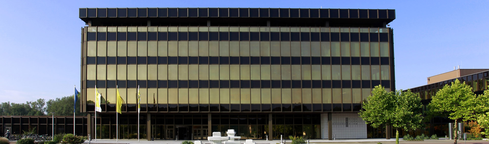

# Welcome to HEART 2020 at PC²

# Overview

The HEART symposium is an international forum on state-of-the-art research in high-performance and power-efficient computing using accelerator technologies such as FPGAs, GPGPUs, and/or specialized accelerators. The eleventh edition of HEART will take place in Paderborn, DE sometime in 2020.

