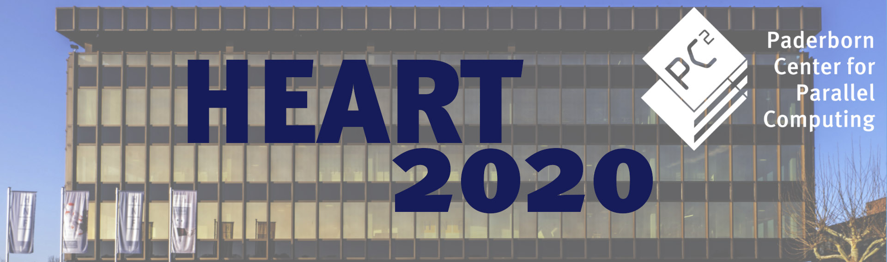

# International Symposium on Highly Efficient Accelerators and Reconfigurable Technologies (HEART 2020)

# LATES UPDATES

* 2020-01-07 Announced keynote speaker: Jack Dongarra ["Using Mixed Precision in Numerical Computiation"](keyspeaker.md))
* 2020-01-06 Final program committee announced (see [Committee](committee.md))

# Overview and Venue

The International symposium on Highly Efficient Accelerators and Reconfigurable Technologies (HEART) is a forum to present and discuss new research on computing systems utilizing acceleration technology. The main theme of HEART is achieving high efficiency with accelerators, which is of utmost importance across a wide spectrum of computing systems. In the high performance computing and data center domains, high efficiency mostly relates to performance, while in the mobile and IoT space research communities think about accelerators more from a power/energy perspective.

The eleventh edition of HEART will take place in Paderborn, Germany. The event will start with pre-symposium Workshops and Tutorials on **June 17, 2020**. The symposium will be held **June 18 -19, 2020**.

The conference will be held at the [Heinz Nixdorf MuseumsForum](https://www.hnf.de/en/home.html) - the worlds largest computer museum. See [Venue](venue.md) for more information.
