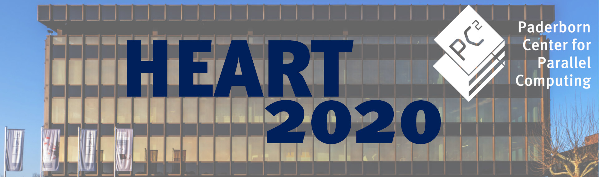

# International Symposium on Highly Efficient Accelerators and Reconfigurable Technologies (HEART 2020)

Follow us on Twitter: [@heart_symp](https://twitter.com/heart_symp)

# Keynotes

* Prof. Jack Dongarra, University of Tennessee, Knoxville, USA: «Using Mixed Precision in Numerical Computation»
* Prof. Marilyn Wolf, University of Nebraska-Lincoln, USA: «The Case for Edge Intelligence»

# Latest Updates

* 2020-02-17 Submission deadline extended to 8 March 2020
* 2020-02-17 **We highly recommend to book your room very early maybe before you finally confirm your travel to Heart2020. Usually, a hotel room reservation can be canceled free of charge.**
* 2020-02-13 Announced keynote speaker: Marilyn Wolf ["The Case for Edge Intelligence"](keyspeaker.md)
* 2020-01-31 Clarified that ACM sigconf proceedings style shall be used to format papers, see [Submission](submission.md)
* 2020-01-31 Tutorials announced. HEART 2020 will offer two half-day tutorials on developing FPGA accelerators using Xilinx' and Intel's latest high-level design environments (see [Tutorials](tutorials.md))
* 2020-01-13 Announced special session chairs. Holger Fröning of Heidelberg University will chair the special session on High-Performance Computing / Data Center / Cloud. Smail Niar, Université Polytechnique Hauts-de-France will chair the special session on Mobile Systems / Edge Computing / Internet of Things.
* 2020-01-07 HEART is on Twitter now, follow [@heart_symp](https://twitter.com/heart_symp) to keep up to date
* 2020-01-07 Announced keynote speaker: Jack Dongarra ["Using Mixed Precision in Numerical Computation"](keyspeaker.md)
* 2020-01-06 Final program committee announced (see [Committee](committee.md))

# Overview and Venue

The International symposium on Highly Efficient Accelerators and Reconfigurable Technologies (HEART) is a forum to present and discuss new research on computing systems utilizing acceleration technology. The main theme of HEART is achieving high efficiency with accelerators, which is of utmost importance across a wide spectrum of computing systems. In the high performance computing and data center domains, high efficiency mostly relates to performance, while in the mobile and IoT space research communities think about accelerators more from a power/energy perspective.

The eleventh edition of HEART will take place in Paderborn, Germany. The event will start with pre-symposium Workshops and Tutorials on **June 17, 2020**. The symposium will be held **June 18 -19, 2020**.

The conference will be held at the [Heinz Nixdorf MuseumsForum](https://www.hnf.de/en/home.html) - the worlds largest computer museum. See [Venue](venue.md) for more information.
