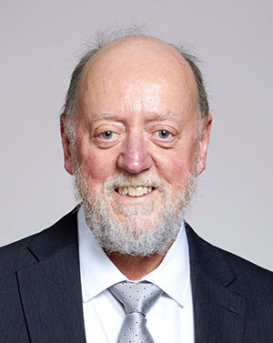

# Keynote Speakers

## Prof. Jack Dongarra, University of Tenessee, Knoxville, USA

### Using Mixed Precision in Numerical Computation

** Abstract ** 

Low-precision floating-point arithmetic is a powerful   tool for accelerating scientific computing   applications, especially those in artificial intelligence.  Here, we present an investigation showing that other high-performance computing (HPC) applications can also harness this power.  Specifically, we use the general HPC problem, Ax=b, where A is a large dense matrix, and a double precision (FP64) solution is needed for accuracy. Our approach is based on mixed-precision (FP16 and FP64) iterative refinement, and we generalize and extend prior advances into a framework, for which we develop architecture-specific algorithms and highly tuned implementations. These new methods show how using half-precision Nvidia Tensor Cores (FP16-TC) for the arithmetic can provide up to 4×speedup.  This is due to the performance boost that the FP16-TC provide as well as to the improved accuracy over the classical FP16 arithmetic that is obtained because the GEMM accumulation occurs in FP32 arithmetic.

** Bio **

Jack Dongarra received a Bachelor of Science in Mathematics from Chicago State University in 1972 and a Master of Science in Computer Science from the Illinois Institute of Technology in 1973. He received his Ph.D. in Applied Mathematics from the University of New Mexico in 1980. He worked at the Argonne National Laboratory until 1989, becoming a senior scientist. He now holds an appointment as University Distinguished Professor of Computer Science in the Electrical Engineering and Computer Science Department at the University of Tennessee and holds the title of Distinguished Research Staff in the Computer Science and Mathematics Division at Oak Ridge National Laboratory (ORNL); Turing Fellow at Manchester University; an Adjunct Professor in the Computer Science Department at Rice University. He is the director of the Innovative Computing Laboratory at the University of Tennessee. He is also the director of the Center for Information Technology Research at the University of Tennessee which coordinates and facilitates IT research efforts at the University.

He specializes in numerical algorithms in linear algebra, parallel computing, the use of advanced-computer architectures, programming methodology, and tools for parallel computers. His research includes the development, testing and documentation of high quality mathematical software. He has contributed to the design and implementation of the following open source software packages and systems: EISPACK, LINPACK, the BLAS, LAPACK, ScaLAPACK, Netlib, PVM, MPI, NetSolve, Top500, ATLAS, and PAPI. He has published over 400 articles, papers, reports and technical memoranda and he is coauthor of several books. He was awarded the IEEE Sid Fernbach Award in 2004 for his contributions in the application of high performance computers using innovative approaches; in 2008 he was the recipient of the first IEEE Medal of Excellence in Scalable Computing; in 2010 he was the first recipient of the SIAM Special Interest Group on Supercomputing's award for Career Achievement; in 2011 he was the recipient of the IEEE Charles Babbage Award; in 2013 he was the recipient of the ACM/IEEE Ken Kennedy Award for his leadership in designing and promoting standards for mathematical software used to solve numerical problems common to high performance computing, and in 2019 he was awarded the SIAM/ACM Prize in Computational Science and Engineering. He is a Fellow of the AAAS, ACM, IEEE, and SIAM and a Foreign Member of the Russian Academy of Sciences, a Foreign Fellow of the British Royal Society, and a Member of the US National Academy of Engineering.